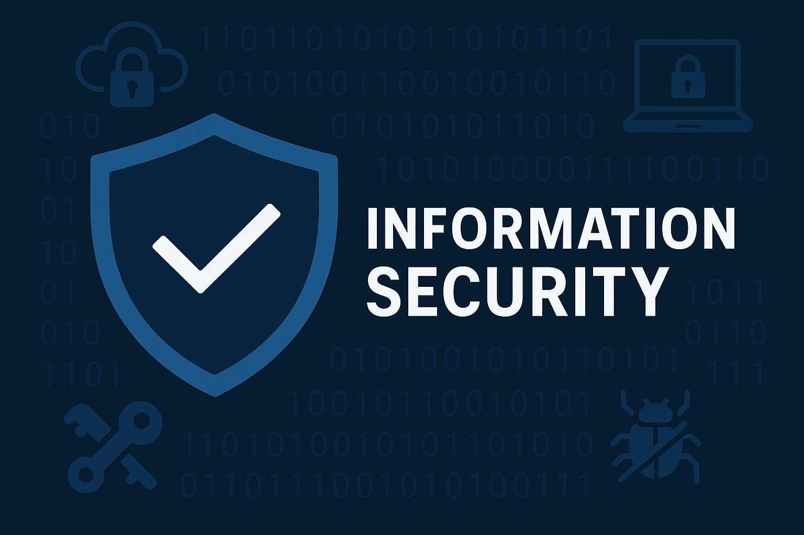

# 🛡️Security & Infrastructure Knowledge Base

**Security & Infrastructure Administrator | Cloud Migration Specialist | Endpoint Management | Systems Optimization**

Welcome to my personal GitHub repository — a curated hub of technical documentation, configuration snippets, automation scripts, and hands-on labs from my journey in the IT world. Whether you're here to learn, reference, or collaborate, I'm glad you stopped by.

---

## 👋🏾 About Me

I'm a seasoned IT professional with over a decade of experience in securing networks, managing server infrastructure, and leading cloud modernization projects. From legacy Windows servers to cutting-edge Azure deployments, I specialize in building resilient, secure, and scalable environments. This space serves as both my personal knowledge base and a resource for others in the field.

---

## 💼 Experience Highlights

### 🖥️ Security & Infrastructure Administrator – (Oct 2019 – Present)
- Migrated Exchange & Active Directory to Azure cloud services
- Implemented Microsoft Intune & Autopilot for modern endpoint management
- Deployed and managed Wazuh SIEM
- Designed GPO and Intune compliance baselines
- Supported servers, SonicWall firewalls, Unifi networks, Meraki MDM
- VOIP (Mitel), Surveillance systems, and Alarm Systems

### 🏢 Systems Administrator – Global
- Managed server operations and network infrastructure
- Oversaw system maintenance, support, and upgrades
- Implemented security protocols and managed data backups

  
### 🛠️ Senior IT Support / Store Implementation Specialist
- Supported large enterprise infrastructure, hosted services, and POS systems  
- Troubleshot network and hardware issues  
- Mentored junior technicians  
- Interfaced with vendors and stakeholders

---

## 🧰 Technical Toolbox

**Cloud & Virtualization:** Azure, Intune, Meraki MDM, VMware, SonicWall  
**Security:** Wazuh SIEM, GPO Hardening, Threat Hunting, Network Segmentation  
**Systems:** Windows Server (2000–2025), Linux (Ubuntu, Debian), MacOS  
**Tools:** PowerShell, Bash, Docker, Webmin, cPanel, Joomla, Unifi, Mitel VOIP  
**Endpoint Management:** Intune, Autopilot, AD, MDM Solutions  
**Recovery & Backups:** Server backups, Disaster Recovery, Exchange Online migrations  

---

## 📂 Repository Structure

- `docs/` – Technical documentation and how-to guides  
- `scripts/` – PowerShell, Bash, and Python automation scripts  
- `playbooks/` – Incident response, system setup, and recovery plans  
- `tools/` – Handpicked tools, utilities, and configuration templates  

---

## 🔍 Focus Areas

- 🔐 Endpoint Hardening (Windows/Linux)
- 🌐 Network Security & Firewall Configurations
- ☁️ Cloud Security (Azure, AWS)
- ⚙️ Automation Scripting & Tooling
- 📋 IT Policies & Procedures
- 📦 Backup & Disaster Recovery
- 🧠 Threat Hunting & SIEM Configurations

---

## 📘 Featured Repositories

- [🔐 security-infra-notes](https://github.com/DatProphet/security-infra-notes)  
  _Scripts, guides, and configurations from my real-world IT journey._

- [☁️ azure-intune-policies](https://github.com/DatProphet/azure-intune-policies)  
  _Practical Intune & Azure config snippets and GPO mappings. COMING SOON_

- [🧠 wazuh-siem-lab](https://github.com/DatProphet/wazuh-siem-lab)  
  _A home lab setup and examples of Wazuh alerts and response rules. COMING SOON_

---

## 🎓 Education & Certifications

- **Systems & Network Administration**  
- **Microsystems & Network Technician**
- **A+ Certified**

---

## 📫 Let’s Connect

- [🔗 LinkedIn](https://www.linkedin.com/in/jason-morgan-9a56348/)  
- 📧 gemineyez76@gmail.com  
- 📍 Canada  

---

_“Stay secure. Keep learning. Keep building.”_

